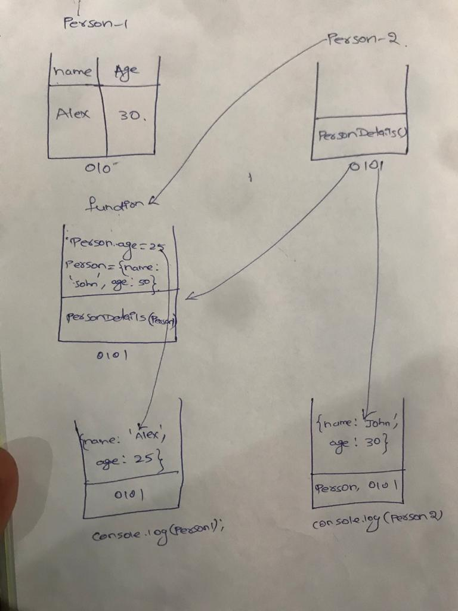

1. What will be the output and explain the reason.

```js
let obj = { name: 'Arya' };
obj = { surname: 'Stark' };
let newObj = { name: 'Arya' };
let user = obj;
let arr = ['Hi'];
let arr2 = arr;
```

Answer the following with reason after going through the above code:

- `[10] === [10]` // false
- What is the value of obj? // { surname: 'Stark' }
- `obj == newObj` // false
- `obj === newObj` // false
- `user === newObj` // false
- `user == newObj` // false
- `user == obj` // true
- `arr == arr2` // true
- `arr === arr2` // true

2. What's will be the value of `person1` and `person2` ? Explain with reason. Draw the memory representation diagram.

<!-- To add this image here use  -->


```js
function personDetails(person) {
  person.age = 25;
  person = { name: 'John', age: 50 };
  return person;
}
var person1 = { name: 'Alex', age: 30 };
var person2 = personDetails(person1);
console.log(person1); // { name: 'Alex', age: 25 };
// Here person1 will be executed first and after that it will execute person2. Since, it has the value of the function it will go to the function and access the data inside the function in that way the person1 age will get updated to 25
console.log(person2); // person = { name: 'John', age: 50 };
// Here since the person2 has been calling the function called personDetails. We are returning the person variable and it will get executed to person2 
```

3. What will be the output of the below code:

```js
var brothers = ['Bran', 'John'];
var user = {
  name: 'Sansa',
};
user.brothers = brothers;
brothers.push('Robb');
console.log(user.brothers === brothers); //1. true
console.log(user.brothers.length === brothers.length); //2. true
```
